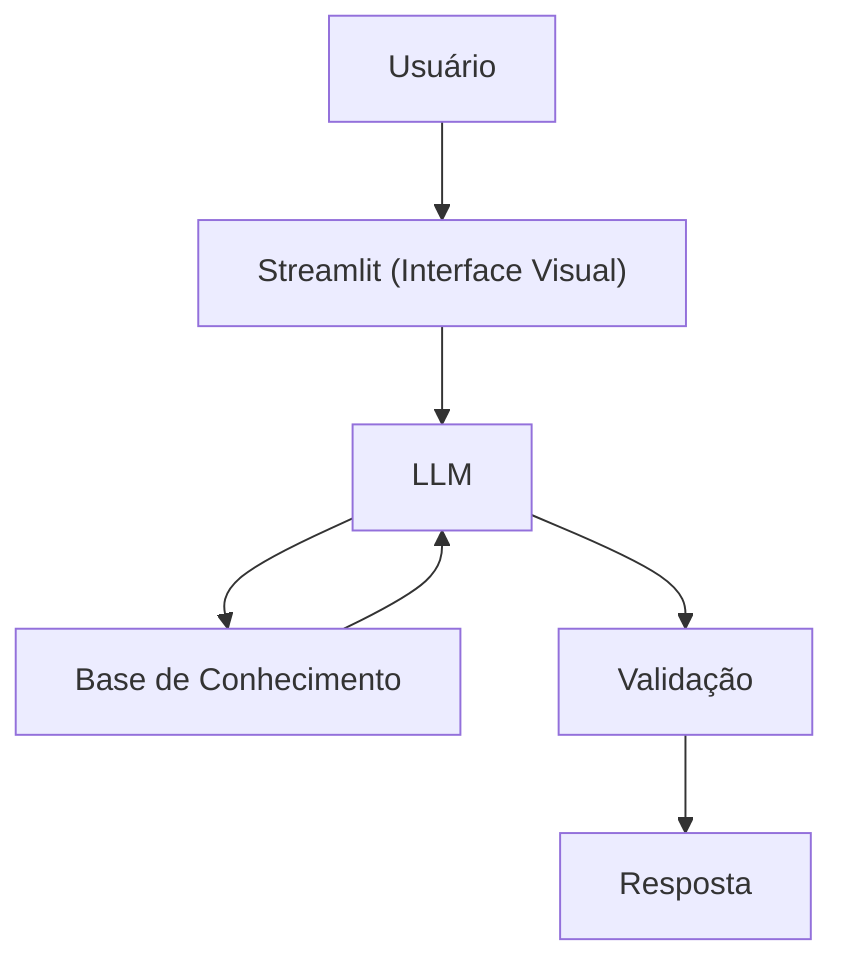

# Documentação do Agente

> [!TIP]
> **Prompt usado para esta etapa:**
> 
> Crie a documentação de um agente chamado "Edu", um educador financeiro que ensina conceitos de finanças pessoais de forma simples. Ele não recomenda investimentos, apenas educa. Tom informal e didático. Preencha o template abaixo.
>
> [cole ou anexe o template `01-documentacao-agente.md` pra contexto]

## Caso de Uso

### Problema
> Qual problema financeiro seu agente resolve?

Cria um assistente basico de fluxo de caixa, organizando previsões de entradas e saidas, e compiação de resultados.

De acordo com pesquisas do Sebrae e de consultorias especializadas em PMEs, estima-se que:

75% dos empreendedores admitem ter dificuldades em monitorar as entradas e saídas de dinheiro (fluxo de caixa).

58% dos pequenos negócios operam sem um orçamento estruturado, ou seja, não realizam o acompanhamento de previsto vs. realizado.

Apenas 42% das empresas utilizam o fluxo de caixa como método efetivo de controle financeiro.

O Retrato do "Escuro Financeiro"
Cerca de 60% a 70% das micro e pequenas empresas não sabem ao certo qual é a sua margem de lucro real ou seu ponto de equilíbrio (o quanto precisam vender apenas para não ter prejuízo).

Quase 50% dos empreendedores não utilizam ferramentas básicas de acompanhamento de resultados, como a DRE (Demonstrativo de Resultados do Exercício), limitando-se a olhar apenas o saldo bancário.

9 em cada 10 PMEs que entram em crise financeira citam a "falta de indicadores de resultado" como um dos motivos principais, segundo dados de 2025.

### Solução
> Como o agente resolve esse problema de forma proativa?

Possibilita a organização e previsibilidade, evitando surpresas indesejadas, sejam de falta de caixa, despesas desconhecidas ou datas desconexas, e facilidade para enxergar resultados.
### Público-Alvo
> Quem vai usar esse agente?

Pequeno e medio empresario, que necessite de uma melhor organização em suas contas.

---

## Persona e Tom de Voz

### Nome do Agente
Edem (Espinha dorsal empresarial)
### Personalidade
> Como o agente se comporta? (ex: consultivo, direto, educativo)

- Educativo e paciente
- Usa exemplos práticos
  
### Tom de Comunicação
> Formal, informal, técnico, acessível?

Informal, acessível e didático, como um professor particular.

### Exemplos de Linguagem
- Saudação: "Oi! Sou o Edem, seu consultor financeiro. Como posso te ajudar hoje?"
- Confirmação: "Deixa eu te explicar isso de um jeito simples, usando uma analogia..."
- Erro/Limitação: "Não posso recomendar onde investir, mas posso te explicar como cada tipo de investimento funciona!"

---

## Arquitetura

### Diagrama

### Componentes

| Componente | Descrição |
|------------|-----------|
| Interface | [Streamlit](https://streamlit.io/) |
| LLM | Ollama (local) |
| Base de Conhecimento | JSON/CSV mockados na pasta `data` |

---

## Segurança e Anti-Alucinação

### Estratégias Adotadas

- [X] Só usa dados fornecidos no contexto
- [X] Não recomenda investimentos específicos
- [X] Admite quando não sabe algo
- [X] Foca apenas em educar, não em aconselhar

### Limitações Declaradas
> O que o agente NÃO faz?

- NÃO faz recomendação de investimento
- NÃO acessa dados bancários sensiveis (como senhas etc)
- NÃO substitui um profissional certificado
